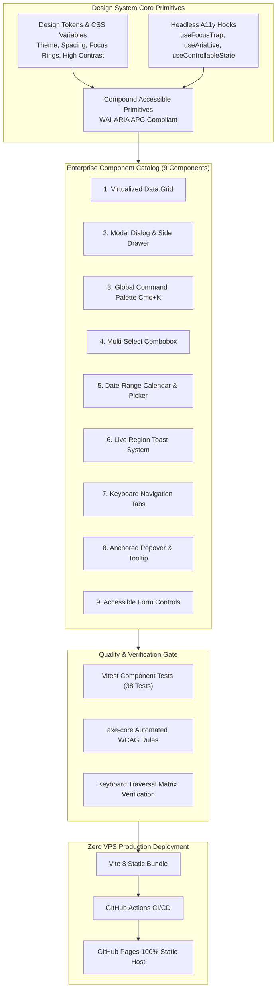

# Accessible UI | Enterprise Component System & Workbench

[](https://github.com/DonytXz/accessible-ui/actions)
[](https://donatoalvarez.dev/accessible-ui/)
[](#wcag-21-aa-compliance-matrix)
[](https://github.com/dequelabs/axe-core)
[](#zero-vps-architecture)

A production-grade, accessible enterprise component system and interactive workbench built with **React 19**, **TypeScript**, **Tailwind CSS v4**, **Vitest**, and **axe-core**. Engineered to demonstrate senior/staff-level UI infrastructure design, adherence to the official **W3C WAI-ARIA Authoring Practices Guide (APG)**, and zero-maintenance static deployment.

---

## 1. Executive Summary & Engineering Case Study

### The Problem
Enterprise web applications frequently break accessibility contracts:
1. **Focus Hijacking & Leaks:** Modal overlays fail to trap keyboard focus, allowing invisible `Tab` keys to interact with background controls, or lose focus completely on close.
2. **Silent State Transitions:** Asynchronous data updates, toast alerts, and filtered search counts happen visually without alerting assistive technologies.
3. **DOM Bloat & Performance Degradation:** Standard HTML tables rendering 1,000+ records cause severe frame drops, delayed input responsiveness (poor INP), and memory spikes.
4. **Keyboard Blindness:** Complex widgets (2D data grids, comboboxes, date pickers) lack standardized arrow-key navigation, forcing keyboard-only users into repetitive, frustrating tab-stops.

### The Architectural Solution
**Accessible UI** solves these systemic problems at the foundational infrastructure layer:
* **Headless Primitives & Hooks:** Isolated, reusable accessibility hooks (`useFocusTrap`, `useKeyNavigation`, `useAriaLive`, `useControllableState`) governing keyboard state and screen-reader announcements independently of visual presentation.
* **Virtualized 60 FPS Rendering:** High-throughput DOM windowing using `@tanstack/react-virtual` allowing 50,000+ data grid records to render with sub-16ms frame times.
* **Automated Accessibility Testing Gates:** Every component build is gated by `vitest` unit tests paired with `axe-core` rule verification, guaranteeing zero WCAG 2.1 AA violations.
* **Interactive Design System Workbench:** An embedded live inspection portal providing real-time ARIA state inspection, keyboard interaction matrices, and instant code copy.

---

## 2. Technical Architecture & Data Flow



---

## 3. Enterprise Component Catalog & APG Compliance

| Component | WAI-ARIA APG Pattern | Key Keyboard Interactions | Senior Engineering Highlights |
|---|---|---|---|
| **Virtualized Data Grid** | `role="grid"`<br/>`role="columnheader"`<br/>`role="gridcell"` | `Arrow Keys` (2D navigation)<br/>`Home` / `End` (row boundaries)<br/>`Ctrl+Home`/`End` (grid corners)<br/>`PageUp`/`PageDown` (10 rows) | TanStack Virtual 60 FPS windowing handling 50,000+ records. Multi-column sorting (`aria-sort`), sticky headers. |
| **Modal & Side Drawer** | `role="dialog"`<br/>`aria-modal="true"`<br/>`aria-labelledby` | `Tab` / `Shift+Tab` (cyclic trap)<br/>`Escape` (dismiss & restore focus) | Cyclical focus trap, body scroll-lock with scrollbar compensation, automatic focus restoration to trigger element. |
| **Command Palette** | `role="combobox"`<br/>`aria-expanded="true"`<br/>`aria-activedescendant` | `⌘+K` / `Ctrl+K` (global toggle)<br/>`ArrowDown`/`ArrowUp` (selection)<br/>`Enter` (execute action) | Live region announcement (`aria-live="polite"`), fuzzy matching across categories, recent actions registry. |
| **Multi-Select Combobox** | `role="combobox"`<br/>`role="listbox"`<br/>`aria-multiselectable` | `ArrowDown`/`ArrowUp` (traverse)<br/>`Enter` (select/toggle)<br/>`Backspace` (delete previous tag) | Removable token badges with accessible delete buttons (`aria-label="Remove [tag]"`), asynchronous search support. |
| **Date-Range Calendar** | `role="grid"`<br/>`role="gridcell"`<br/>`aria-selected="true"` | `ArrowLeft`/`Right` (±1 day)<br/>`ArrowUp`/`Down` (±1 week)<br/>`PageUp`/`Down` (±1 month) | Pure native JavaScript `Date` and `Intl.DateTimeFormat` math with zero external date dependencies. Range calculations. |
| **Toast System** | `role="status"` (`polite`)<br/>`role="alert"` (`assertive`) | `Tab` (focuses action button)<br/>`Enter`/`Space` (dismiss) | Auto-pause countdown timer on mouse hover or keyboard focus, un-intrusive live announcements. |
| **Keyboard Tabs** | `role="tablist"`<br/>`role="tab"`<br/>`role="tabpanel"` | `ArrowLeft`/`Right` (horizontal)<br/>`ArrowUp`/`Down` (vertical)<br/>`Home`/`End` (boundaries) | Connected `aria-controls` and `aria-labelledby`, automatic or manual activation modes, active pill indicator. |
| **Tooltip & Popover** | `role="tooltip"` (`aria-describedby`)<br/>`role="dialog"` | `Tab` (shows on focus)<br/>`Escape` (dismiss without blur) | Safe hover polygon delay, viewport boundary collision detection, non-modal dialog popovers. |
| **Accessible Form Controls** | `<label htmlFor="...">`<br/>`aria-invalid="true"`<br/>`role="switch"` | `Space` / `Enter` (toggle switch)<br/>`Tab` (navigate inputs) | Dynamic error message association via `aria-errormessage`, high-contrast WCAG 2.4.7 focus visible rings. |

---

## 4. WCAG 2.1 AA Compliance Matrix

| WCAG Guideline | Level | How It Is Satisfied |
|---|---|---|
| **1.3.1 Info and Relationships** | A | All inputs, tables, and dialogs utilize semantic HTML5 elements or explicit ARIA roles (`role="grid"`, `aria-labelledby`, `aria-describedby`). |
| **1.4.3 Contrast (Minimum)** | AA | All text content maintains >= 4.5:1 contrast ratio against background surfaces in both Dark and Light themes. |
| **1.4.11 Non-text Contrast** | AA | Interactive component borders, focus rings, and switches maintain >= 3.0:1 contrast against adjacent colors. |
| **1.4.13 Content on Hover or Focus** | AA | Tooltips and popovers are dismissible via `Escape`, hoverable without collapsing, and persistent until explicit focus loss. |
| **2.1.1 Keyboard** | A | 100% of component functionality is operable using only a keyboard without requiring specific timings. |
| **2.1.2 No Keyboard Trap** | A | Focus traps in modals and drawers cyclically route `Tab` and `Shift+Tab` without trapping the user permanently; `Escape` immediately frees focus. |
| **2.2.1 Timing Adjustable** | A | Toasts automatically pause their auto-dismiss timers whenever a user hovers with a pointer or moves keyboard focus into the notification. |
| **2.4.7 Focus Visible** | AA | Explicit `:focus-visible` ring (`0 0 0 2px var(--border-focus)`) with 2px offset rendered across all interactive controls. |
| **4.1.2 Name, Role, Value** | A | Dynamic states (`aria-expanded`, `aria-selected`, `aria-checked`, `aria-sort`, `aria-activedescendant`) updated synchronously. |
| **4.1.3 Status Messages** | AA | Live regions (`role="status"` and `role="alert"`) notify screen-reader users of search filter results and toast dispatches. |

---

## 5. Automated Testing & Verification

The repository runs 38 unit and accessibility tests across all components using Vitest, React Testing Library, and `axe-core`:

```bash
# Run complete test suite with axe-core audits
npm test

# Run tests with coverage report
npm run test:coverage
```

### Automated Accessibility Test Example:
```typescript
import { render } from '@testing-library/react'
import { assertNoA11yViolations } from '@/test/a11y-helper'
import { DataGrid } from '@/components/DataGrid/DataGrid'

it('should have zero axe-core accessibility violations', async () => {
  const { baseElement } = render(<DataGrid data={mockData} columns={mockCols} />)
  await assertNoA11yViolations(baseElement)
})
```

---

## 6. Zero VPS Architecture & Deployment

This project requires **zero VPS infrastructure, zero databases, and zero server maintenance**:
* Runs **100% client-side** in modern browsers.
* Builds into static HTML, CSS, and JS bundles via Vite.
* Automatically deployed to **GitHub Pages** on every push to `main` through GitHub Actions.

### Quick Start: Local Development
```bash
# Clone repository
git clone https://github.com/DonytXz/accessible-ui.git
cd accessible-ui

# Install dependencies
npm install

# Start interactive workbench dev server
npm run dev

# Run automated tests
npm test

# Compile production bundle
npm run build
```

---

## 7. License

MIT License. Designed and authored by Daniel Alvarez.
